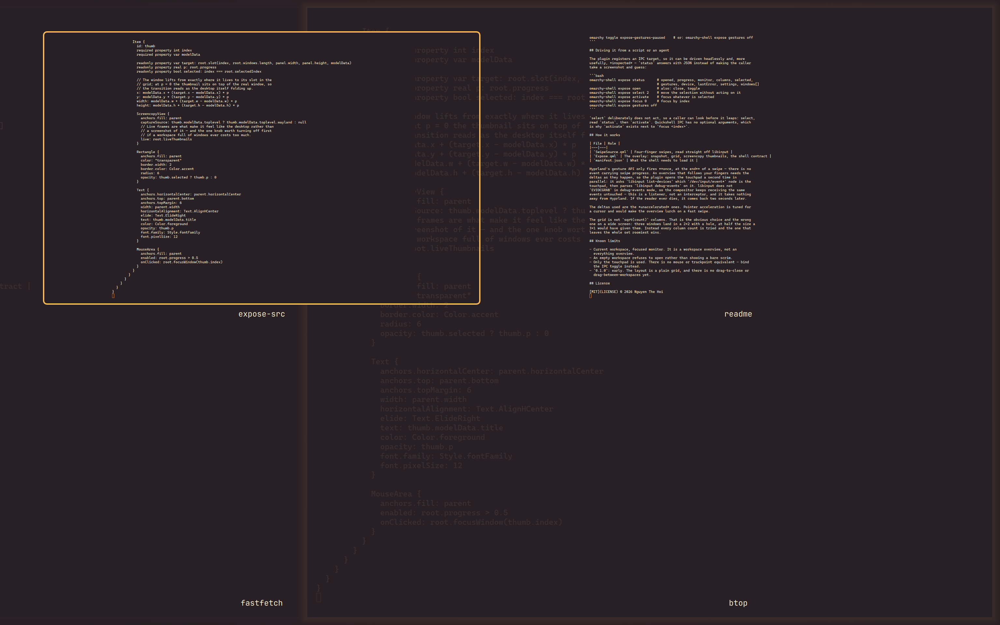

# Exposé — Mission Control for Hyprland

An overlay plugin for [Omarchy 4](https://omarchy.org/) that puts the windows of
the current workspace on one screen. Swipe **four fingers up** and every window
lifts off the desktop into a grid; **four fingers down** puts it back. The
overview follows your fingers the whole way — it is not an animation that plays
after the gesture ends.

*[Tiếng Việt](README.vi.md)*



## Nothing is ever moved

The windows keep their real position and size for the entire gesture. What flies
into the grid is a live screencopy of each window, drawn on a layer above the
desktop over a scrim.

That is deliberate. Omarchy's layout is `scrolling`, and a real "arrange
everything into a grid, then restore it" would destroy the column state with no
way to ask Hyprland to put it back exactly. Because the thumbnails are live, a
video keeps playing and a terminal keeps scrolling while the overview is open.

## Requirements

- **Omarchy 4** or newer — the release where the desktop moved to
  `omarchy-shell` (Quickshell). Omarchy 3 had no plugin host.
- Your user in the **`input` group**, so the gesture reader can read
  `/dev/input/event*`. Check with `groups`; if `input` is missing:

  ```bash
  sudo usermod -aG input $USER   # log out and back in
  ```
- The `libinput` CLI, which ships in **`libinput-tools`** — the library alone is
  not enough, and a stock Omarchy install does not have the tools package:

  ```bash
  omarchy pkg add libinput-tools
  ```
  `stdbuf` (coreutils) is already there. If either is missing the plugin says so
  in a notification rather than going quietly deaf.

## Install

```bash
omarchy plugin add https://github.com/hoojiNT/omarchy-expose.git
omarchy plugin enable hooji.expose
```

The repository is named `omarchy-expose`, but it installs to
`~/.config/omarchy/plugins/hooji.expose/` — Omarchy names the directory after
the manifest `id`, not the repository. That is expected, not a mistake.

> **Plugins run unsandboxed inside the `omarchy-shell` process.** That is true of
> every Omarchy plugin, including this one. `omarchy plugin add` lands it
> disabled so you can read the code first, and `omarchy plugin update` shows you
> a diff before applying it. Only install repositories whose code you are willing
> to run.

Update and remove:

```bash
omarchy plugin update hooji.expose
omarchy plugin remove hooji.expose
```

## Using it

| Action | Result |
|---|---|
| Four fingers up | Open the overview, tracking your fingers |
| Four fingers down | Close it |
| Four fingers left/right, overview closed | Previous/next workspace |
| Four fingers left/right, overview open | Walk the selection across the grid |
| Click a window | Focus it and close |
| Click the background | Close |
| `←` `→` / `Tab` / `Shift+Tab` | Move the selection |
| `↑` `↓` | Move a whole row |
| `Home` / `End` | First / last window |
| `Enter` / `Space` | Focus the selected window |
| `Esc` | Close |

Release matters as much as distance: a quick flick opens or closes even if you
did not travel far, while a slow drag that stops halfway snaps to whichever end
is nearer. Let go without committing and it springs back.

It can also be driven without the touchpad, which is what to bind if you want a
keyboard shortcut — add this to `~/.config/hypr/bindings.lua`:

```lua
o.bind("SUPER + TAB", "Window overview", "omarchy-shell shell toggle hooji.expose '{}'")
```

## Why it takes all four directions

Hyprland's native workspace swipe cannot be enabled and disabled at runtime, so
a plugin that only claimed "up" would end up fighting the compositor over
horizontal swipes while the overview was open. This one owns all four four-finger
directions and dispatches the workspace switch itself. **Three-finger gestures
are untouched** and keep doing whatever you have bound them to.

## Settings

Settings live in the plugin's own entry in `~/.config/omarchy/shell.json`, which
hot-reloads on save. [`config.example.json`](config.example.json) is that entry
with every key at its default — copy the keys you want to change into the entry
you already have:

```json
{
  "plugins": [
    { "id": "hooji.expose", "threshold": 260, "liveThumbnails": false }
  ]
}
```

| Key | Default | What it does |
|---|---|---|
| `fingers` | `4` | Which swipe to listen for |
| `threshold` | `220` | Travel, in libinput units, that counts as a full gesture |
| `naturalWorkspaceSwipe` | `true` | Swiping right moves the desktop right; flip it if that feels backwards |
| `liveThumbnails` | `true` | Live capture per window. Turn off first if a crowded workspace ever costs too much |
| `scrimOpacity` | `0.92` | How far the desktop is dimmed behind the grid |

> The `{ "id": "hooji.expose" }` entry is also what marks the plugin **enabled**.
> Remove a key you no longer want, never the whole entry.

Or write one without editing the file — this persists through the shell's own
writer:

```bash
omarchy-shell expose set threshold 260
```

Pausing is separate from configuring. It stops the touchpad reader outright
while leaving the overview one keybinding away, which is what you want for a
game or a screen share:

```bash
omarchy toggle expose-gestures-paused    # or: omarchy-shell expose gestures off
```

## Driving it from a script or an agent

The plugin registers an IPC target, so it can be driven headlessly and, more
usefully, *inspected* — `status` answers with JSON instead of making the caller
take a screenshot and guess:

```bash
omarchy-shell expose status      # opened, progress, monitor, columns, selected,
                                 # gestures, device, lastError, settings, windows[]
omarchy-shell expose open        # also: close, toggle
omarchy-shell expose select 2    # move the selection without acting on it
omarchy-shell expose activate    # focus whatever is selected
omarchy-shell expose focus 0     # focus by index
omarchy-shell expose gestures off
```

`select` deliberately does not act, so a caller can look before it leaps: select,
read `status`, then `activate`. Quickshell IPC has no optional arguments, which
is why `activate` exists next to `focus <index>`.

## How it works

| File | Role |
|---|---|
| `SwipeSource.qml` | Four-finger swipes, read straight off libinput |
| `Expose.qml` | The overlay: snapshot, grid, screencopy thumbnails, the shell contract |
| `manifest.json` | What the shell needs to load it |

Hyprland's gesture API only fires **once, at the end** of a swipe — there is no
event carrying swipe progress. An overview that follows your fingers needs the
deltas as they happen, so the plugin opens the touchpad a second time in
parallel: it asks `libinput list-devices` which `/dev/input/event*` node is the
touchpad, then parses `libinput debug-events` on it. libinput does not
`EVIOCGRAB` in debug-events mode, so the compositor keeps receiving the same
events untouched — this is a listener, not an interceptor, and it takes nothing
away from Hyprland. If the reader ever dies, it comes back two seconds later.

The deltas used are the *unaccelerated* ones. Pointer acceleration is tuned for
a cursor and would make the overview lurch on a fast swipe.

The grid is not `sqrt(count)` columns. That is the obvious choice and the wrong
one on a wide screen: three windows land in a 2×2 with a hole, at half the size a
3×1 would have given them. Instead every column count is tried and the one that
leaves the whole set roomiest wins.

## Known limits

- Current workspace, focused monitor. It is a workspace overview, not an
  everything overview.
- An empty workspace refuses to open rather than showing a bare scrim.
- Only the touchpad is used. There is no mouse or trackpoint equivalent — bind
  the IPC toggle instead.
- `0.1.0`: early. The layout is a plain grid, and there is no drag-to-close or
  drag-between-workspaces yet.

## License

[MIT](LICENSE) © 2026 Nguyen The Hoi
